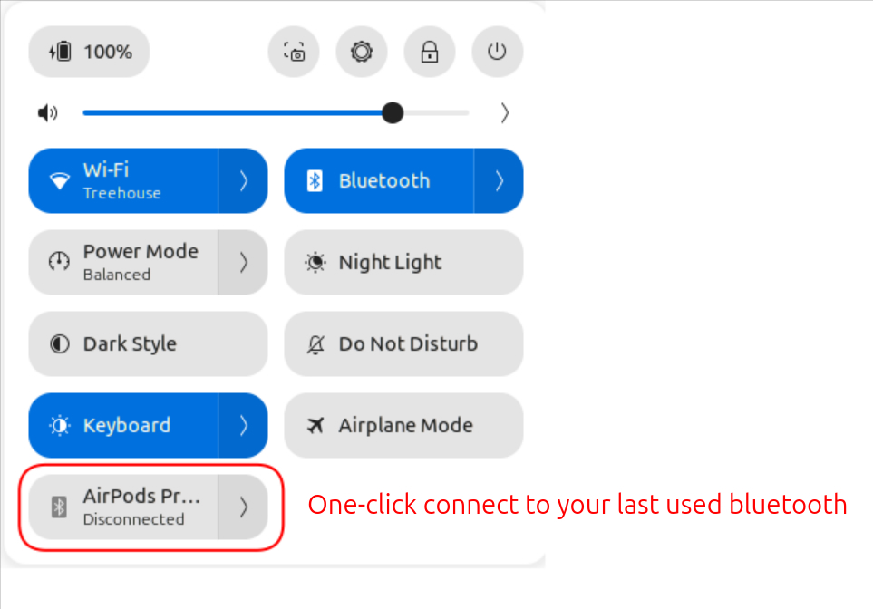
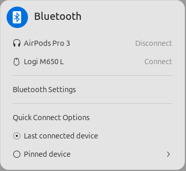
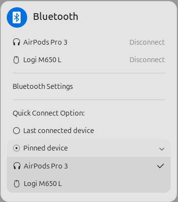

# Quick Last-Bluetooth
Realized that 99 out of 100 times, the only reason you connect to a Bluetooth device is to use your earphones—and yet GNOME makes you click twice and select the same device from the same list every time?

This GNOME Shell extension adds a Bluetooth button to the Quick Settings panel. Click it to instantly connect to your most recently used Bluetooth device, or open its menu to choose a different paired device as your default.


## Screenshots







## Install

Install from
[extensions.gnome.org](https://extensions.gnome.org/extension/quick-last-bluetooth/)
(recommended), or build and install manually:

```bash
make install
```

This compiles the GSettings schema and copies the extension into
`~/.local/share/gnome-shell/extensions/quick-last-bluetooth@tech.puffyslippers.com`.
Log out and back in, then enable it:

```bash
gnome-extensions enable quick-last-bluetooth@tech.puffyslippers.com
```

## Local install on another computer

To install on a machine without this repo:

1. Build the bundle on your dev machine:

   ```bash
   make pack
   ```

   This produces `quick-last-bluetooth@tech.puffyslippers.com.shell-extension.zip`.

2. Copy the script and the zip to the target computer (same folder):

   ```bash
   scp local_install.sh quick-last-bluetooth@tech.puffyslippers.com.shell-extension.zip user@host:
   ```

3. On the target computer, run the script:

   ```bash
   ./local_install.sh
   ```

   The script disables the extension if present, extracts the zip into
   `~/.local/share/gnome-shell/extensions/quick-last-bluetooth@tech.puffyslippers.com`,
   and compiles the GSettings schema.

4. Log out and back in (or press `Alt+F2`, type `r`, and press Enter) to
   reload GNOME Shell, then enable the extension:

   ```bash
   gnome-extensions enable quick-last-bluetooth@tech.puffyslippers.com
   ```

## Build

```bash
make pack
```

Produces `quick-last-bluetooth@tech.puffyslippers.com.shell-extension.zip`.

## License

[GPL-3.0-or-later](LICENSE)
