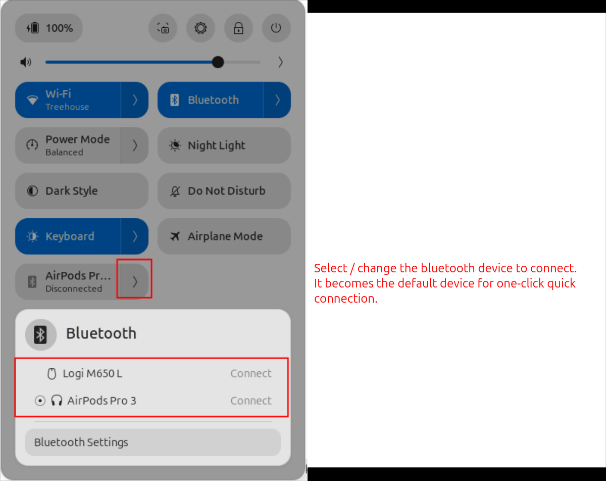

# Quick Last-Bluetooth
Realized that 99 out of 100 times, the only reason you connect to a Bluetooth device is to use your earphones—and yet GNOME makes you click twice and select the same device from the same list every time?

This GNOME Shell extension adds a Bluetooth button to the Quick Settings panel. Click it to instantly connect to your most recently used Bluetooth device, or open its menu to choose a different paired device as your default.


## Screenshots




## Install

Install from
[extensions.gnome.org](https://extensions.gnome.org/extension/quick-last-bluetooth/)
(recommended), or build and install manually:

```bash
make install
```

This compiles the GSettings schema and copies the extension into
`~/.local/share/gnome-shell/extensions/quick-last-bluetooth@tech.puffyslippers.com`.
Log out and back in, then enable it:

```bash
gnome-extensions enable quick-last-bluetooth@tech.puffyslippers.com
```

## Build

```bash
make pack
```

Produces `quick-last-bluetooth@tech.puffyslippers.com.shell-extension.zip`.

## License

[GPL-3.0-or-later](LICENSE)
